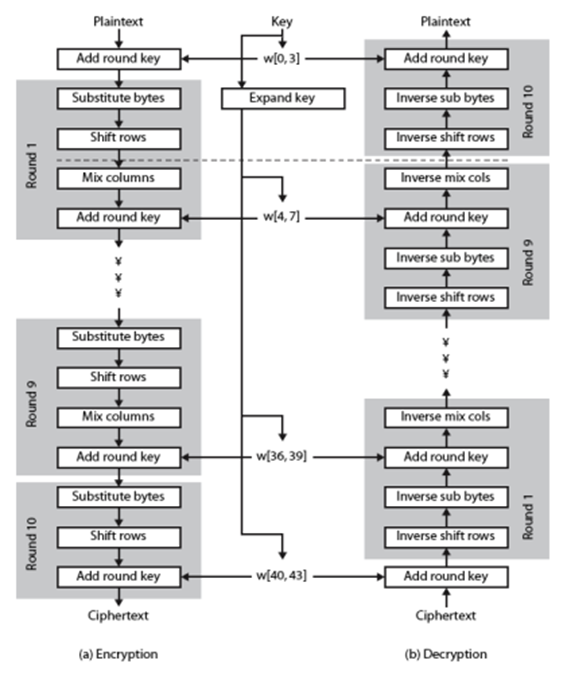

# AES Acceleration with GPU - Naive implemntation

This repository contains the source code for the ME759 project - AES Acceleration with GPU. This project naive implementation of AES cryptographic algorithm. The parallel implementation of AES can be found here - [AES Parallel](./../parallel/)

## Configurations

The following configurations are present in the main.cuh file and can be modified as mentioned below.

| Configuration Defines   | Functionality |
| --------------------- | ------------- |
| `DEBUG`               | If set to 1, debug print statements like printing round keys will be enabled |
| `DISPLAY_INPUTS`      | If set to 1, inputs of the AES algorithm (key, plain text) are printed |
| `COPYABLE_FORMAT`     | If set to 1, prints will be in the form of a bit stream instead of 0xbb so that it can be directly copied for verification |
| `USE_DEFAULT_INPUTS`  | When enabled, the default inputs (plain text and key) will be used for encryption |
| `TIME_NAIVE`          | Enable timing of naive implementation of Key Expansion |
| `AES_MODE`            | Configure the AES mode. AES_CTR is currently not supported |

### Non Configurable Defines

| Configuration Defines   | Functionality |
| --------------------- | ------------- |
| `AES_KEY_SIZE`        | Configure AES key size. Currently supports only 128 |
| `AES_KEY_SIZE_BYTES`  | For internal reference |
| `AES_BLK_LENGTH`      | Block length of AES (16 bytes) |

## Using the code example

* By default the code is configured to execute using the default plain text and key i.e; `USE_DEFAULT_INPUTS` is set to 1.
* The code can be executed by running the *taskrun.sh* script using the following command
```
sbatch taskrun.sh
```

<br />

* Set `USE_DEFAULT_INPUTS` to 0 and `COPYABLE_FORMAT` and `DISPLAY_INPUTS` to 1. The code can be then run so as to use random inputs for plain text and key. Comment the previous execution command and uncomment - **./main 1024** in *taskrun.sh* script.

* For scaling analysis, the following code in the *taskrun.sh* script should be uncommented. Ensure that the `DISPLAY_INPUTS` and `USE_DEFAULT_INPUTS` are set to 0 and change **#SBATCH -t 0-0:10:00** to **#SBATCH -t 0-0:30:00**
```
for i in {5..6}
do 
    val=$((2**$i))
    echo "** Running the AES Algorithm for N = $val**"
    ./main $val
done
```

## Operation

### AES Algorithm
The AES algorithm can be broadly divided into two categories:
* Key Expansion
* AES Encryption

AES symmetric key is 128 bits (16 bytes) for AES-128 and 256 bits (32 bytes) for AES-256. In the key expansion step, this symmetric key is expanded to obtain round keys – 176 bytes for AES-128 and 240 bytes for AES-256. This round key will then be used in each round of the AES algorithm. For the key expansion step, the following procedure is followed – 

* The first block (16 bytes) of the round key is the key itself.
* For the next block the last row of the key is shifted by 1
* Each element of the last row is substituted with the corresponding element from the S-Box matrix
* To the substituted row, a round constant is added
* The resultant row is then XORed with the first row of the previous round key block to obtain the first row of the current block
* To obtain the subsequent rows, the previous row of the current block is XORed with the current row of the previous block
* This entire procedure is repeated 10 times in AES-128 and 14 times in AES-256 to obtain the entire round key

AES encryption is a block-wise algorithm wherein it handles one block at a time. The block that is currently being operated on is called the state matrix. AES encryption can be further divided into the following steps – 
* Add Round Keys – Each element of the round key is added to each element of the state matrix
* Substitute Bytes – Each element of the state matrix is substituted with the corresponding element from the S-Box matrix
* Shift Rows – The elements in the nth row of the state matrix are shifted by n times
* Mix Columns – The resultant matrix of the previous step undergoes a Galois Multiplications

Before the computation of the round key is started the Add Round Key step is introduced. The subsequent rounds except the last round follow this sequence – Substitute Bytes, Shift Rows, Mix Columns, and Add Round Keys. In the last round, the Mix Columns step is omitted. 


<br />

For a detailed understanding of AES, the CrypTool 2 which enables AES visualization can be used. For the convenience of the reader, the visualization of the AES key expansion and AES encryption is recorded and can be found [here](./../docs/video/). The AES algorithm was first implemented using just the CPU without any parallelization and then tested that the algorithm works. All matrices are stored using 1D arrays in column-major representation. 

A function call was implemented for each of the steps mentioned above and these were called for each round for each of the blocks in the plain text. The key expansion was implemented in a separate source file. 

## References

* The source for the error check function to detect kernel launch errors - [What is the canonical way to check for errors using the CUDA runtime API?](https://stackoverflow.com/questions/14038589/what-is-the-canonical-way-to-check-for-errors-using-the-cuda-runtime-api)
* Stackoverflow and Nvidia Development forums were used to resolve issues with Cuda/OpenMP 
* Some of the code was derived directly from my HW submissions (timing, random number generation etc)
* For AES visualization which provided a step by step visualization of AES works - [CrypTool 2](https://www.cryptool.org/en/ct2/)
* For the understanding some of the theory behind AES:
    * [AES Wiki](https://en.wikipedia.org/wiki/Advanced_Encryption_Standard)
    * [AES – The Advanced Encryption Standard Explained (YouTube video)](https://www.youtube.com/watch?v=h6wvqm0aXco)
    * [AES Explained (Advanced Encryption Standard) - Computerphile (YouTube video)](https://www.youtube.com/watch?v=O4xNJsjtN6E)
* For understanding the mix columns step: 
    * [Understanding AES Mix-Columns Transformation Calculation](https://www.angelfire.com/biz7/atleast/mix_columns.pdf)
    * [Rijndael MixColumns Wiki](https://en.wikipedia.org/wiki/Rijndael_MixColumns)
    * [How to solve MixColumns](https://crypto.stackexchange.com/questions/2402/how-to-solve-mixcolumns)
* AES online calculators for analysis and verification
    * ECB:
        * [OnlineDomainTools]http://aes.online-domain-tools.com/
        * [The X AES encryption / decryption](https://the-x.cn/en-US/cryptography/Aes.aspx)
    * CTR:
        * [Cryptii](https://cryptii.com/pipes/aes-encryption)
* README Reference - [Cypress Semiconductors README format](https://github.com/Infineon/mtb-example-psoc4-wdc/)
