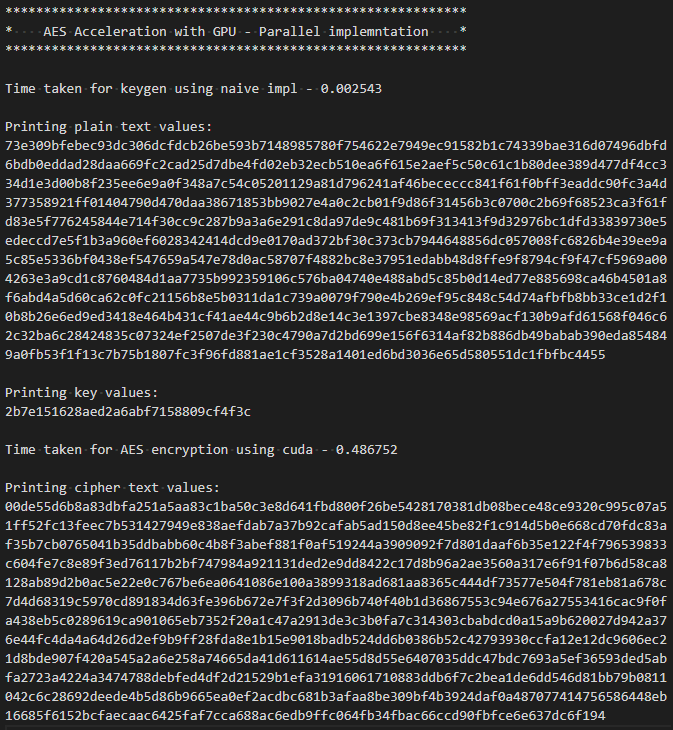
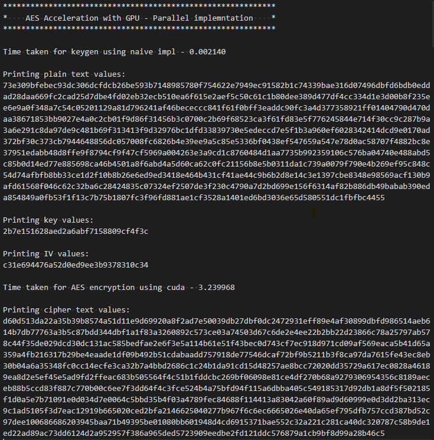

# AES Acceleration with GPU - Parallel implemntation

This repository contains the source code for the ME759 project - AES Acceleration with GPU. This project tries to parallelize AES cryptographic algorithm by using CUDA (and OpenMP). The naive implementation of AES can be found here - [AES Naive](./../naive/)

## Configurations

The following configurations are present in the main.cuh file and can be modified as mentioned below.

| Configuration Defines   | Functionality |
| --------------------- | ------------- |
| `DEBUG`               | If set to 1, debug print statements like printing round keys will be enabled |
| `DISPLAY_INPUTS`      | If set to 1, inputs of the AES algorithm (key, plain text) are printed |
| `COPYABLE_FORMAT`     | If set to 1, prints will be in the form of a bit stream instead of 0xbb so that it can be directly copied for verification |
| `USE_DEFAULT_INPUTS`  | When enabled, the default inputs (plain text and key) will be used for encryption |
| `ENABLE_NAIVE`        | When enabled, naive implementation is used for key generation |
| `ENABLE_OPENMP`       | When enabled, OpenMP is used for key generation |
| `ENABLE_CUDA`         | Non configurable. CUDA should always be enabled for AES parallel implementation |
| `TIME_NAIVE`          | Enable timing of naive implementation of Key Expansion |
| `TIME_OPENMP`         | Enable timing of OpenMP implementation of Key Expansion |
| `TIME_CUDA`           | Enable timing of CUDA AES implementation |
| `AES_MODE`            | Configure the AES mode. Supported values are AES_ECB, AES_CTR |

### Non Configurable Defines

| Configuration Defines   | Functionality |
| --------------------- | ------------- |
| `AES_KEY_SIZE`        | Configure AES key size. Currently supports only 128 |
| `AES_KEY_SIZE_BYTES`  | For internal reference |
| `AES_BLK_LENGTH`      | Block length of AES (16 bytes) |

## Using the code example

* By default the code is configured to execute using the default plain text and key i.e; `USE_DEFAULT_INPUTS` is set to 1.
* The code can be executed by running the *taskrun.sh* script using the following command
```
sbatch taskrun.sh
```

<br />

* Set `USE_DEFAULT_INPUTS` to 0 and `COPYABLE_FORMAT` and `DISPLAY_INPUTS` to 1. The code can be then run so as to use random inputs for plain text and key. Comment the previous execution command and uncomment - **./main 1024** in *taskrun.sh* script.

* To run AES in counter mode change **AES_MODE** from **AES_ECB** to **AES_CTR**.


<br />

* For scaling analysis, the following code in the *taskrun.sh* script should be uncommented. Ensure that the `DISPLAY_INPUTS` and `USE_DEFAULT_INPUTS` are set to 0 and change **#SBATCH -t 0-0:10:00** to **#SBATCH -t 0-0:30:00**
```
for i in {5..6}
do 
    val=$((2**$i))
    echo "** Running the AES Algorithm for N = $val**"
    ./main $val
done
```
## Operation

For a detailed description of the AES algorithm, please refer [here](./../naive/README.md).

### Key Expansion using OpenMP
In key expansion the output of each row depends on the result of the previous row. Similarly, the output of each round depends on the result of the previous round which makes things hard to parallelize. However, if we consider column-wise, the next element is dependent on the previous element of the same column but there is no dependency on any other elements from any other column. This gives way to parallelizing the column-wise generation of elements, but it involves some additional branching. As only 4 columns exist and it involves conditional statements OpenMP is used to parallelize key expansion. Each column is considered a section and is allocated to one core.

### AES Encryption using CUDA
AES deals with 16-element blocks with comparatively less dependency on the outcome of the other elements and no dependency on the outcome of other blocks. So, the idea is to use 1 thread per element, in other words, all threads in a warp will handle 2 blocks (1 element per thread). The S-Box values, round keys, plain text, and the final cipher text are stored in the shared memory. The shift array constants (by how much should a particular element be shifted) and the Galois matrix elements are precalculated to avoid computations and are also stored in the shared memory. Each thread copies 2 to 4 elements from one of these buffers into the shared memory based on the threadIdx.x value. The function calls are removed or made inline, and the shifting of the elements is performed by modifying the index of the element. The Mix Columns step requires the elements of the entire row for the Galois multiplication which necessitates all the threads in a warp to be synchronized. The cipher text is then copied back to the device array. The number of threads per block is variable. However, all the constants like S-Box, round constants are needed by each block. Considering the amount of data that needs to be copied for each block it makes more sense to have bigger blocks. When tested I got the best performance with 512 threads per block. The final implementation is tailored for 512 threads. Other optimizations like using unified memory, and combined device array did not result in significant performance gains.

## References

* The source for the error check function to detect kernel launch errors - [What is the canonical way to check for errors using the CUDA runtime API?](https://stackoverflow.com/questions/14038589/what-is-the-canonical-way-to-check-for-errors-using-the-cuda-runtime-api)
* Stackoverflow and Nvidia Development forums were used to resolve issues with Cuda/OpenMP 
* Some of the code was derived directly from my HW submissions (timing, random number generation etc)
* For AES visualization which provided a step by step visualization of AES works - [CrypTool 2](https://www.cryptool.org/en/ct2/)
* For the understanding some of the theory behind AES:
    * [AES Wiki](https://en.wikipedia.org/wiki/Advanced_Encryption_Standard)
    * [AES – The Advanced Encryption Standard Explained (YouTube video)](https://www.youtube.com/watch?v=h6wvqm0aXco)
    * [AES Explained (Advanced Encryption Standard) - Computerphile (YouTube video)](https://www.youtube.com/watch?v=O4xNJsjtN6E)
* For understanding the mix columns step: 
    * [Understanding AES Mix-Columns Transformation Calculation](https://www.angelfire.com/biz7/atleast/mix_columns.pdf)
    * [Rijndael MixColumns Wiki](https://en.wikipedia.org/wiki/Rijndael_MixColumns)
    * [How to solve MixColumns](https://crypto.stackexchange.com/questions/2402/how-to-solve-mixcolumns)
* AES online calculators for analysis and verification
    * ECB:
        * [OnlineDomainTools]http://aes.online-domain-tools.com/
        * [The X AES encryption / decryption](https://the-x.cn/en-US/cryptography/Aes.aspx)
    * CTR:
        * [Cryptii](https://cryptii.com/pipes/aes-encryption)
* README Reference - [Cypress Semiconductors README format](https://github.com/Infineon/mtb-example-psoc4-wdc/)


